# Super Brainstorm Bot - Architecture Document

## Overview

The Super Brainstorm Bot is a Discord-based multi-AI collaboration system that enables multiple AI models (Claude, ChatGPT, Grok, and optionally Cursor) to engage in collaborative brainstorming sessions with human participants. The system includes intelligent conversation management, context compression, and automatic documentation in Notion.

## Core Components

### 1. Discord Bot Core

* **Purpose**: Main entry point for all interactions
* **Responsibilities**:
  * Listen to messages in designated channels
  * Route messages to appropriate handlers
  * Manage conversation state
  * Coordinate AI responses
  * Handle message threading and replies

### 2. AI Adapter System

* **Purpose**: Abstract interface for different AI providers
* **Supported Providers**:
  * OpenAI (ChatGPT)
  * Anthropic (Claude)
  * Grok (X/Twitter API)
  * Cursor (if API available)
* **Responsibilities**:
  * Standardize API calls across providers
  * Handle rate limiting
  * Manage context windows
  * Format responses for Discord

### 3. Conversation Coordinator

* **Purpose**: Orchestrate multi-AI conversations
* **Responsibilities**:
  * Track conversation threads
  * Manage turn-taking logic
  * Detect when AIs should respond
  * Handle context window management
  * Implement conversation limits
  * Queue AI responses
  * Handle AI response failures gracefully
  * Manage conversation timeouts

### 4. Context Manager

* **Purpose**: Manage conversation context and memory
* **Responsibilities**:
  * Track conversation history
  * Monitor context window usage
  * Trigger context refresh from Notion
  * Compress context when needed

### 5. Scribe Bot

* **Purpose**: Create detailed, verbose documentation of conversations in Notion
* **Responsibilities**:
  * Monitor all conversation messages (asynchronously)
  * Create comprehensive, verbose documentation (preserves all important information)
  * Extract and preserve ALL key reasoning and thought processes
  * Maintain complete discussion flow with context
  * Keep technical details, specific findings, and examples
  * Update Notion document with detailed reasoning
  * Maintain conversation history timeline
  * Provide context refresh capability
  * Debounce updates to avoid excessive API calls
  * Handle Notion API failures gracefully
* **Note**: Creates verbose documentation, not compressed summaries. This detailed documentation is used by TLDR bot to extract concise summaries.

### 6. TLDR Bot

* **Purpose**: Extract concise executive summaries from Scribe's detailed documentation
* **Responsibilities**:
  * Monitor conversation progress
  * Read detailed documentation from Notion (Scribe's verbose content)
  * Extract concise executive summaries from the detailed documentation
  * Extract 3-5 key findings from the detailed documentation
  * Update Notion TLDR document
  * Highlight key findings and conclusions
* **Note**: Extracts summaries from Scribe's detailed Notion documentation rather than generating from raw conversation. This creates a two-tier documentation system.

### 7. Session Planner Bot (Session Moderator)

* **Purpose**: Plan, moderate, and oversee conversations to ensure productive outcomes from all participants (AI and human)
* **Responsibilities**:
  * **Planning Phase**:
    * Analyze user's initial message/topic
    * Identify areas needing clarification
    * Post clarifying questions in thread replies
    * Assess appropriate conversation length and complexity
    * Set conversation parameters (max messages, max tokens, timeout)
    * Create a detailed conversation plan
    * Expand on the user's original message
    * Wait for user approval before starting conversation
    * Initialize conversation with approved parameters
    * Transition to active conversation state
  * **Moderation Phase** (Ongoing):
    * Monitor all conversation messages (AI and human participants)
    * Detect topic drift and off-topic discussions
    * Steer conversations back on track when needed
    * Track conversation progress against plan
    * Monitor conversation limits and timeouts
    * Stop conversations when appropriate (time limits, goal achieved, off-track)
    * Ensure productive participation from all personas
    * Provide gentle guidance to keep focus on objectives
    * Assess conversation quality and outcomes

### 8. Notion Integration

* **Purpose**: Persistent storage and documentation
* **Responsibilities**:
  * Store conversation history
  * Store detailed reasoning documentation (from Scribe bot)
  * Store TLDR summaries (from TLDR bot)
  * Provide context retrieval API
  * Provide latest reasoning content retrieval (for TLDR bot)

## System Architecture

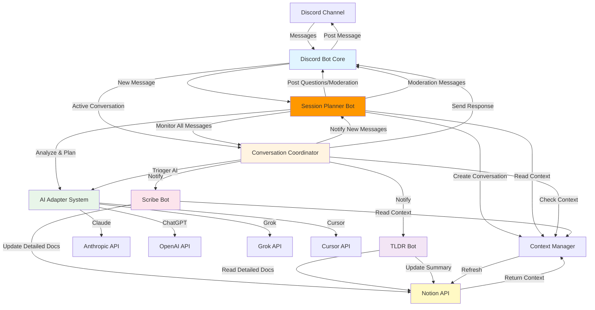

## Conversation Flow

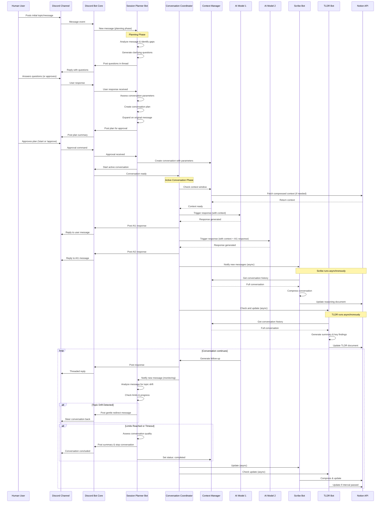

## AI Adapter Architecture

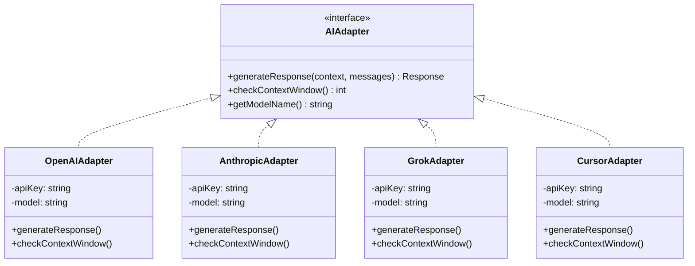

## Context Management Flow

```mermaid
flowchart TD
    Start[New Message/Response] --> CheckContext{Context Window<br/>Usage}
    CheckContext -->|> 50%| FetchNotion[Fetch Compressed Context<br/>from Notion]
    CheckContext -->|<= 50%| UseCurrent[Use Current Context]
    
    FetchNotion --> MergeContext[Merge Notion Context<br/>with Recent Messages]
    UseCurrent --> AddMessage[Add New Message<br/>to Context]
    MergeContext --> AddMessage
    
    AddMessage --> CheckLimit{Conversation<br/>Limit Reached?}
    CheckLimit -->|Yes| StopConversation[Stop Conversation<br/>Notify Users]
    CheckLimit -->|No| Continue[Continue Conversation]
    
    Continue --> TriggerScribe[Trigger Scribe Update<br/>(Async, Non-blocking)]
    TriggerScribe --> Compress[Compress Conversation]
    Compress --> UpdateNotion[Update Notion Document]
    UpdateNotion --> ContinueConversation[Continue Conversation<br/>(Scribe doesn't block)]
    
    style CheckContext fill:#fff4e1
    style CheckLimit fill:#ffebee
    style Compress fill:#e8f5e9
```

## Scribe Bot Workflow

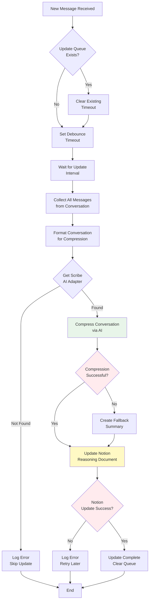

### Scribe Bot Details

* **Verbose Documentation**: Creates detailed, comprehensive documentation rather than compressed summaries
* **Information Preservation**: Preserves ALL key reasoning, thought processes, technical details, and examples
* **Structure**: Maintains complete discussion flow with context in a structured format
* **Debouncing**: Updates are debounced by `SCRIBE_UPDATE_INTERVAL` seconds to avoid excessive API calls
* **Error Handling**: If documentation generation fails, creates a fallback summary with basic conversation stats
* **Non-blocking**: All operations are asynchronous and never block conversation flow
* **Queue Management**: Each conversation has its own update queue with timeout management
* **Prompt**: Uses `src/prompts/scribe-compress.txt` for documentation instructions

## Session Planner Bot Workflow

```mermaid
flowchart TD
    Start[New Initial Message] --> Analyze[Analyze Message<br/>via AI]
    Analyze --> IdentifyGaps[Identify Areas<br/>Needing Clarification]
    
    IdentifyGaps --> HasGaps{Clarification<br/>Needed?}
    HasGaps -->|Yes| GenerateQuestions[Generate Clarifying<br/>Questions via AI]
    HasGaps -->|No| AssessParams[Assess Conversation<br/>Parameters]
    
    GenerateQuestions --> PostQuestions[Post Questions<br/>in Thread Reply]
    PostQuestions --> SetStatusPlanning[Set Conversation<br/>Status: planning]
    SetStatusPlanning --> WaitResponse[Wait for User<br/>Response in Thread]
    
    WaitResponse --> CheckResponse{User<br/>Responded?}
    CheckResponse -->|No| CheckTimeout{Timeout<br/>Reached?}
    CheckTimeout -->|Yes| CancelPlanning[Cancel Planning<br/>Notify User]
    CheckTimeout -->|No| WaitResponse
    
    CheckResponse -->|Yes| ParseResponse[Parse User<br/>Response]
    ParseResponse --> AssessParams
    
    AssessParams --> EstimateComplexity[Estimate Conversation<br/>Complexity]
    EstimateComplexity --> CalculateParams[Calculate Parameters:<br/>- Max Messages<br/>- Max Tokens<br/>- Timeout<br/>- Context Window]
    
    CalculateParams --> CreatePlan[Create Conversation Plan<br/>via AI]
    CreatePlan --> ExpandMessage[Expand on Original<br/>Message via AI]
    ExpandMessage --> FormatPlan[Format Plan with:<br/>- Expanded Topic<br/>- Parameters<br/>- Expected Duration<br/>- Key Areas to Explore]
    
    FormatPlan --> PostPlan[Post Plan Summary<br/>for Approval]
    PostPlan --> WaitApproval[Wait for Approval<br/>Command: !start or !approve]
    
    WaitApproval --> CheckApproval{Approval<br/>Received?}
    CheckApproval -->|No| CheckTimeout2{Timeout<br/>Reached?}
    CheckTimeout2 -->|Yes| CancelPlanning
    CheckTimeout2 -->|No| WaitApproval
    
    CheckApproval -->|Yes| CreateConversation[Create Conversation<br/>with Parameters]
    CreateConversation --> SetStatusActive[Set Status: active]
    SetStatusActive --> InitializeContext[Initialize Context<br/>with Expanded Message]
    InitializeContext --> NotifyCoordinator[Notify Conversation<br/>Coordinator]
    NotifyCoordinator --> Complete[Planning Complete<br/>Conversation Ready]
    
    CancelPlanning --> End[End]
    Complete --> End
    
    style Analyze fill:#ff9800
    style GenerateQuestions fill:#fff4e1
    style AssessParams fill:#e1f5ff
    style CreatePlan fill:#e8f5e9
    style PostPlan fill:#fce4ec
    style CheckApproval fill:#fff9c4
    style CreateConversation fill:#f3e5f5
```

### Session Planner Bot Details

* **Analysis Phase**: Uses AI to analyze the initial message and identify gaps or ambiguities
* **Clarification Questions**: Posts questions as thread replies to the original message
* **Parameter Assessment**: Estimates conversation complexity based on:
  * Topic breadth and depth
  * Expected number of subtopics
  * Required detail level
  * Historical similar conversations
* **Dynamic Parameters**: Sets conversation limits based on assessment:
  * `maxMessagesPerConversation`: Based on expected scope (default: 100-1000)
  * `maxTokensPerConversation`: Based on complexity (default: 100k-5M)
  * `conversationTimeoutMinutes`: Based on expected duration (default: 30-120)
  * `maxContextWindowPercent`: Based on expected context needs (default: 70-80)
* **Plan Creation**: Generates a structured plan including:
  * Expanded and clarified topic description
  * Key areas to explore
  * Expected conversation flow
  * Estimated duration and resource usage
* **Approval Mechanism**: Waits for explicit user approval via `!start` or `!approve` commands
* **Timeout Handling**: Cancels planning if no response within timeout period (default: 30 minutes)

## Session Moderator Workflow (Ongoing Moderation)

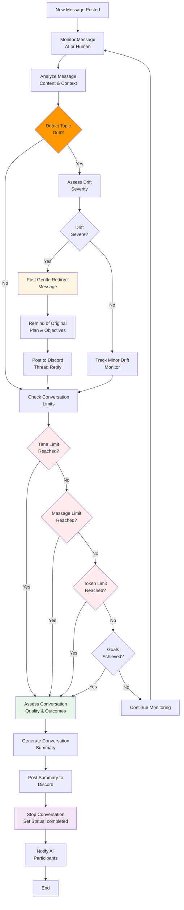

### Session Moderator Details

* **Continuous Monitoring**: Monitors all messages from both AI and human participants in real-time
* **Topic Drift Detection**: Uses AI to analyze message content against original plan and objectives
  * Semantic similarity analysis
  * Keyword/topic tracking
  * Context relevance scoring
* **Gentle Steering**: When off-topic, posts polite redirects that:
  * Acknowledge the current discussion
  * Remind of original objectives
  * Suggest returning to main topic
  * Reference the conversation plan
* **Limit Management**: Actively monitors and enforces:
  * Time limits (conversation timeout)
  * Message count limits
  * Token usage limits
  * Context window usage
* **Quality Assessment**: Before stopping, evaluates:
  * Goals achieved vs. original plan
  * Key insights generated
  * Participant engagement quality
  * Conversation productivity
* **Graceful Termination**: When stopping:
  * Generates conversation summary
  * Highlights key outcomes
  * Thanks all participants
  * Provides closure
* **Participant Oversight**: Ensures:
  * All personas (AI and human) contribute meaningfully
  * No single participant dominates
  * Balanced discussion flow
  * Productive collaboration

## TLDR Bot Workflow

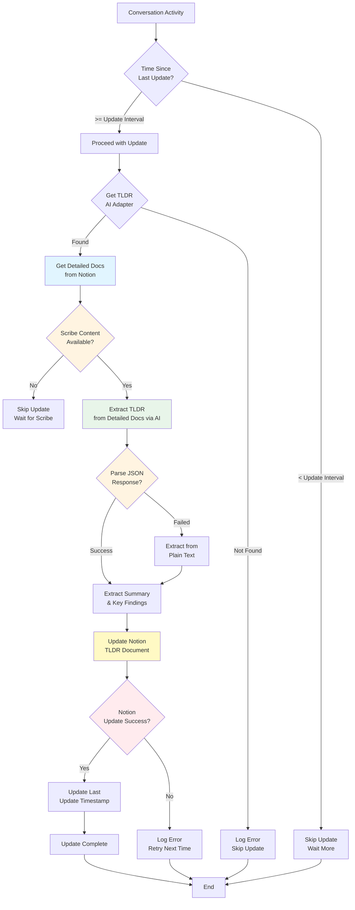

### TLDR Bot Details

* **Source**: Reads detailed documentation from Notion (Scribe's verbose content) rather than raw conversation
* **Two-Tier System**: Extracts concise summaries from the detailed documentation, ensuring no information loss
* **Update Interval**: Only updates every `TLDR_UPDATE_INTERVAL` seconds (default: 600s / 10 minutes)
* **JSON Parsing**: Attempts to parse structured JSON response, falls back to text extraction
* **Key Findings**: Extracts 3-5 key findings or conclusions from the detailed documentation
* **Non-blocking**: All operations are asynchronous and never block conversation flow
* **Timestamp Tracking**: Tracks last update time per conversation to prevent excessive updates
* **Graceful Handling**: Skips update if Scribe content not yet available
* **Prompt**: Uses `src/prompts/tldr-summary.txt` for extraction instructions

## Message Threading Strategy

### Discord Threading Model

* **Reply-to-Message**: Use Discord's message reply feature (references parent message)
* **Message References**: Track which messages each AI is responding to
* **Batch Replies**: When AI responds after multiple messages, reference all relevant messages
* **Thread Channels**: Optionally create Discord thread channels for extended conversations

### Reply Logic

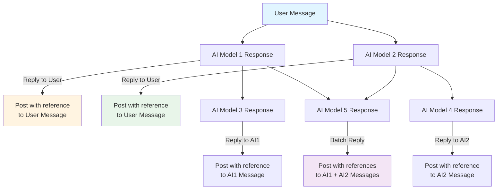

### Batching Logic

* **Time Window**: If multiple messages arrive within 5-10 seconds, AI can batch respond
* **Context Relevance**: AI decides which messages to reference based on relevance
* **Max References**: Limit to 3-5 message references per response (Discord limitation)
* **Smart Batching**: AI analyzes if responses should be combined or separate

## Message Processing Flow

```mermaid
flowchart TD
    DiscordMsg[Discord Message] --> IsCommand{Is Command?<br/>Starts with !}
    IsCommand -->|Yes| HandleCommand[Handle Command<br/>!continue, !stop, etc.]
    IsCommand -->|No| CheckConversation{Conversation<br/>Exists?}
    
    HandleCommand --> End[End]
    
    CheckConversation -->|No| PlanningPhase[Session Planner<br/>Phase]
    CheckConversation -->|Yes| GetConversation[Get Conversation]
    
    PlanningPhase --> AnalyzeMessage[Analyze Initial<br/>Message]
    AnalyzeMessage --> IdentifyGaps[Identify Areas<br/>Needing Clarification]
    IdentifyGaps --> GenerateQuestions[Generate Clarifying<br/>Questions via AI]
    GenerateQuestions --> PostQuestions[Post Questions<br/>in Thread]
    PostQuestions --> WaitResponse[Wait for User<br/>Response]
    
    WaitResponse --> CheckApproval{User Approved<br/>or Answered?}
    CheckApproval -->|No| WaitResponse
    CheckApproval -->|Yes| AssessParams[Assess Conversation<br/>Parameters]
    
    AssessParams --> CreatePlan[Create Conversation<br/>Plan & Expand Message]
    CreatePlan --> PostPlan[Post Plan for<br/>Approval]
    PostPlan --> WaitApproval[Wait for Approval<br/>Command]
    
    WaitApproval --> CheckApprovalCmd{Approval<br/>Received?}
    CheckApprovalCmd -->|No| WaitApproval
    CheckApprovalCmd -->|Yes| CreateConv[Create Conversation<br/>with Parameters]
    CreateConv --> SetActive[Set Status: active]
    SetActive --> GetConversation
    
    GetConversation --> ConvertMsg[Convert to App<br/>Message Format]
    ConvertMsg --> CheckStatus{Conversation<br/>Status?}
    
    CheckStatus -->|active| CheckLimits[Check Conversation<br/>Limits]
    CheckStatus -->|paused/stopped| Ignore[Ignore Message]
    CheckStatus -->|planning| PlanningPhase
    
    CheckLimits --> LimitsOK{Limits<br/>OK?}
    LimitsOK -->|No| StopConv[Stop Conversation<br/>Notify User]
    LimitsOK -->|Yes| CheckContext{Context Window<br/>Usage?}
    
    CheckContext -->|> Threshold| RefreshContext[Refresh Context<br/>from Notion]
    CheckContext -->|OK| AddMessage[Add Message<br/>to Context]
    
    RefreshContext --> AddMessage
    AddMessage --> ShouldRespond{Should AIs<br/>Respond?}
    
    ShouldRespond -->|Yes| TriggerAI[Trigger AI<br/>Responses]
    ShouldRespond -->|No| NotifyScribe[Notify Scribe Bot<br/>Async]
    
    TriggerAI --> QueueResponses[Queue AI Responses<br/>Parallel Processing]
    QueueResponses --> GenerateResponses[Generate Responses<br/>via Adapters]
    GenerateResponses --> PostResponses[Post to Discord<br/>via Callback]
    
    PostResponses --> NotifyModerator[Notify Session Moderator<br/>Monitor Message]
    NotifyModerator --> CheckTopicDrift{Moderator:<br/>Topic Drift?}
    
    CheckTopicDrift -->|Yes| PostRedirect[Moderator: Post<br/>Redirect Message]
    PostRedirect --> NotifyScribe
    CheckTopicDrift -->|No| CheckModeratorLimits{Moderator:<br/>Limits Reached?}
    
    CheckModeratorLimits -->|Yes| StopByModerator[Moderator: Stop<br/>Conversation]
    CheckModeratorLimits -->|No| NotifyScribe
    
    NotifyScribe --> NotifyTLDR[Notify TLDR Bot<br/>Async Check]
    NotifyTLDR --> End
    
    StopByModerator --> End
    
    StopConv --> End
    Ignore --> End
    
    style PlanningPhase fill:#ff9800
    style CheckLimits fill:#ffebee
    style CheckContext fill:#fff4e1
    style TriggerAI fill:#e8f5e9
    style NotifyScribe fill:#fce4ec
    style NotifyTLDR fill:#f3e5f5
    style CheckApproval fill:#fff9c4
    style AssessParams fill:#e1f5ff
    style CheckTopicDrift fill:#ff9800
    style CheckModeratorLimits fill:#ff9800
    style PostRedirect fill:#fff4e1
```

## AI Response Generation Flow

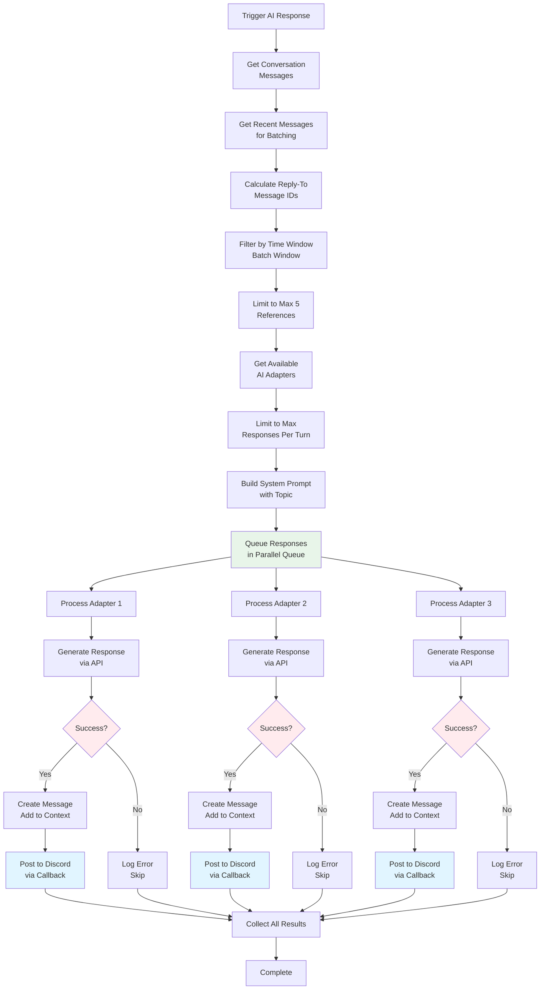

## Data Models

### Conversation State

```typescript
interface ConversationState {
  id: string;
  channelId: string;
  topic: string;
  participants: string[]; // AI model names + user IDs
  messages: Message[];
  contextWindow: {
    current: number;
    max: number;
    provider: string;
  };
  status: 'planning' | 'active' | 'paused' | 'completed' | 'stopped';
  planningState?: {
    questions: string[];
    plan?: string;
    expandedTopic?: string;
    parameters?: {
      maxMessages: number;
      maxTokens: number;
      timeoutMinutes: number;
      maxContextWindowPercent: number;
    };
    awaitingApproval: boolean;
  };
  moderationState?: {
    topicDriftCount: number;
    lastTopicCheck: Date;
    originalObjectives: string[];
    currentFocus: string;
    participantBalance: Map<string, number>; // participantId -> message count
    qualityScore?: number;
  };
  createdAt: Date;
  lastActivity: Date;
  messageCount: number;
  tokenCount: number;
}
```

### Message

```typescript
interface Message {
  id: string;
  conversationId: string;
  authorId: string;
  authorType: 'user' | 'ai';
  content: string;
  replyTo: string[]; // Array of message IDs
  timestamp: Date;
  model?: string; // If AI message
  tokens?: number;
}
```

### AI Response

```typescript
interface AIResponse {
  content: string;
  model: string;
  tokens: number;
  replyTo: string[];
  contextUsed: number;
}
```

## Configuration

### Environment Variables

```bash
# Discord
DISCORD_BOT_TOKEN=
DISCORD_GUILD_ID=
DISCORD_CHANNEL_ID=

# OpenAI
OPENAI_API_KEY=
OPENAI_MODEL=gpt-4-turbo-preview

# Anthropic
ANTHROPIC_API_KEY=
ANTHROPIC_MODEL=claude-3-opus-20240229

# Grok
GROK_API_KEY=
GROK_MODEL=grok-beta

# Cursor (optional)
CURSOR_API_KEY=
CURSOR_MODEL=

# Notion
NOTION_API_KEY=
NOTION_REASONING_PAGE_ID=
NOTION_TLDR_PAGE_ID=

# Conversation Limits
MAX_MESSAGES_PER_CONVERSATION=1000
MAX_TOKENS_PER_CONVERSATION=5000000
MAX_CONTEXT_WINDOW_PERCENT=80
CONTEXT_REFRESH_THRESHOLD=50
CONVERSATION_TIMEOUT_MINUTES=60
MAX_AI_RESPONSES_PER_TURN=3
BATCH_REPLY_TIME_WINDOW_SECONDS=60

# Scribe Configuration
SCRIBE_UPDATE_INTERVAL=60 # seconds
SCRIBE_MODEL=chatgpt # Which AI to use as scribe

# TLDR Configuration
TLDR_UPDATE_INTERVAL=600 # seconds
TLDR_MODEL=chatgpt # Which AI to use for TLDR

# Session Planner Configuration
SESSION_PLANNER_MODEL=claude # Which AI to use as session planner
SESSION_PLANNER_TIMEOUT_MINUTES=30 # Timeout for planning phase
SESSION_PLANNER_MAX_QUESTIONS=5 # Maximum clarifying questions to ask
SESSION_PLANNER_AUTO_START=false # Auto-start without approval (for testing)

# Session Moderator Configuration
MODERATOR_CHECK_INTERVAL=10 # Check for topic drift every N messages
MODERATOR_TOPIC_DRIFT_THRESHOLD=0.6 # Semantic similarity threshold (0-1)
MODERATOR_MAX_DRIFT_WARNINGS=3 # Max redirects before considering stopping
MODERATOR_PARTICIPANT_BALANCE_CHECK=true # Monitor participant message balance
MODERATOR_QUALITY_ASSESSMENT=true # Assess conversation quality before stopping
```

## API Integrations

### Discord API

* **Library**: discord.js
* **Features**:
  * Message listening
  * Message threading/replies
  * Rich embeds
  * Rate limiting handling

### OpenAI API

* **Endpoint**: `https://api.openai.com/v1/chat/completions`
* **Model**: gpt-4-turbo-preview or gpt-4
* **Context Window**: 128k tokens

### Anthropic API

* **Endpoint**: `https://api.anthropic.com/v1/messages`
* **Model**: claude-3-opus-20240229 or claude-3-sonnet
* **Context Window**: 200k tokens

### Grok API

* **Endpoint**: `https://api.x.ai/v1/chat/completions` (verify actual endpoint)
* **Model**: grok-beta
* **Context Window**: Verify with API docs
* **Note**: May require X/Twitter API access or separate xAI API access

### Cursor API

* **Endpoint**: TBD (research required)
* **Model**: TBD
* **Context Window**: TBD
* **Note**: Cursor may not have a public API. If unavailable, this adapter can be skipped or implemented as a placeholder for future support

### Notion API

* **Endpoint**: `https://api.notion.com/v1`
* **Features**:
  * Page updates
  * Block manipulation
  * Database queries
  * Rich text formatting

## Implementation Steps

### Phase 1: Foundation

1. Set up project structure
2. Initialize Node.js/TypeScript project
3. Set up environment configuration
4. Install core dependencies

### Phase 2: Discord Integration

1. Create Discord bot application
2. Implement message listening
3. Implement message posting with threading
4. Add rate limiting handling

### Phase 3: AI Adapter System

1. Create AI adapter interface
2. Implement OpenAI adapter
3. Implement Anthropic adapter
4. Implement Grok adapter
5. Research and implement Cursor adapter (if available)
6. Add adapter factory/registry

### Phase 4: Session Planner Bot (Session Moderator)

1. **Planning Phase**:
   * Implement message analysis logic
   * Create clarification question generation
   * Implement parameter assessment algorithm
   * Create conversation plan generation
   * Implement message expansion logic
   * Add approval mechanism and timeout handling
   * Integrate with conversation creation
2. **Moderation Phase**:
   * Implement continuous message monitoring
   * Create topic drift detection algorithm
   * Implement semantic similarity analysis
   * Create gentle redirect message generation
   * Implement limit monitoring and enforcement
   * Create conversation quality assessment
   * Implement graceful conversation termination
   * Add participant balance tracking
   * Create conversation summary generation

### Phase 5: Conversation Management

1. Implement conversation state tracking
2. Create conversation coordinator
3. Implement turn-taking logic
4. Add conversation limits and controls
5. Integrate with Session Planner for initialization

### Phase 6: Context Management

1. Implement context window tracking
2. Create context compression logic
3. Implement Notion context retrieval
4. Add context refresh triggers

### Phase 7: Scribe Bot

1. Implement conversation monitoring
2. Create compression/summarization logic
3. Implement Notion document updates
4. Add history maintenance

### Phase 8: TLDR Bot

1. Implement summary generation
2. Create TLDR update logic
3. Implement Notion TLDR document updates
4. Add key findings extraction

### Phase 9: Notion Integration

1. Set up Notion API client
2. Create page structure templates
3. Implement document update logic
4. Add formatting and structure

### Phase 10: Testing & Refinement

1. Test individual components
2. Test end-to-end flows
3. Test context management
4. Test conversation limits
5. Optimize performance

### Phase 11: Documentation & Deployment

1. Create user documentation
2. Create setup guide
3. Add error handling and logging
4. Prepare deployment configuration

## Error Handling

### API Failures

* **Retry Strategy**: Exponential backoff (1s, 2s, 4s, 8s, max 30s)
* **Max Retries**: 3 attempts per request
* **Fallback**: If one AI fails, others continue; log error and notify
* **Circuit Breaker**: Temporarily disable failing adapters after repeated failures

### AI Response Error Handling Flow

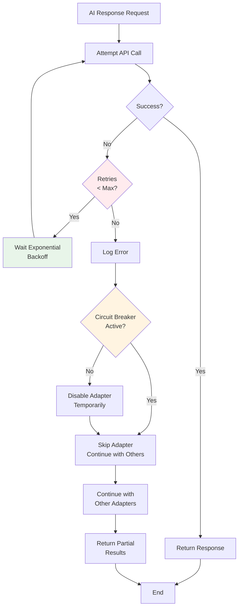

### Notion Error Handling Flow

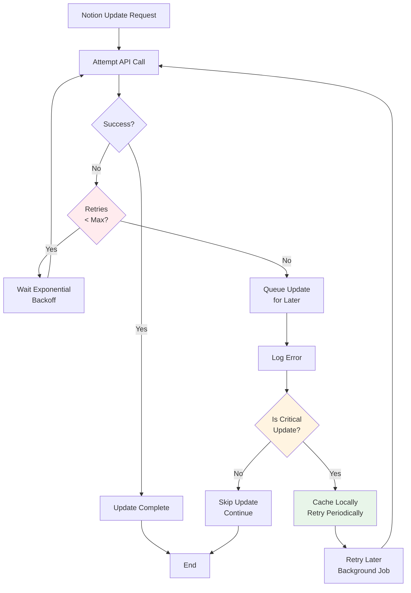

### Discord Error Handling Flow

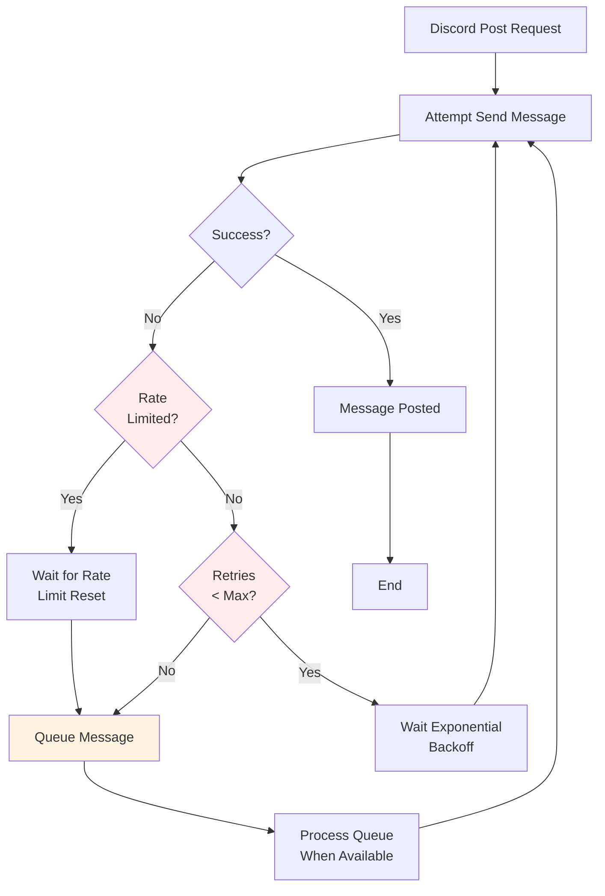

### Rate Limiting

* **Queue Management**: FIFO queue for AI requests per provider
* **Rate Limit Tracking**: Track requests per minute/hour per API
* **Backpressure**: Pause requests when rate limits approached
* **Discord Rate Limits**: Respect 50 requests/second limit, batch when possible

### Context Overflow

* **Automatic Compression**: Trigger when context > 80% full
* **Notion Refresh**: Fetch compressed context when > 50% full
* **Emergency Compression**: Force compression if context exceeds limits
* **Token Counting**: Accurate token counting per provider (use tiktoken, etc.)

### Notion Failures

* **Update Queue**: Queue failed updates and retry
* **Local Cache**: Cache updates locally until Notion succeeds
* **Batch Updates**: Group multiple updates to reduce API calls
* **Fallback Storage**: Log to file if Notion unavailable

## Notion Integration Flow

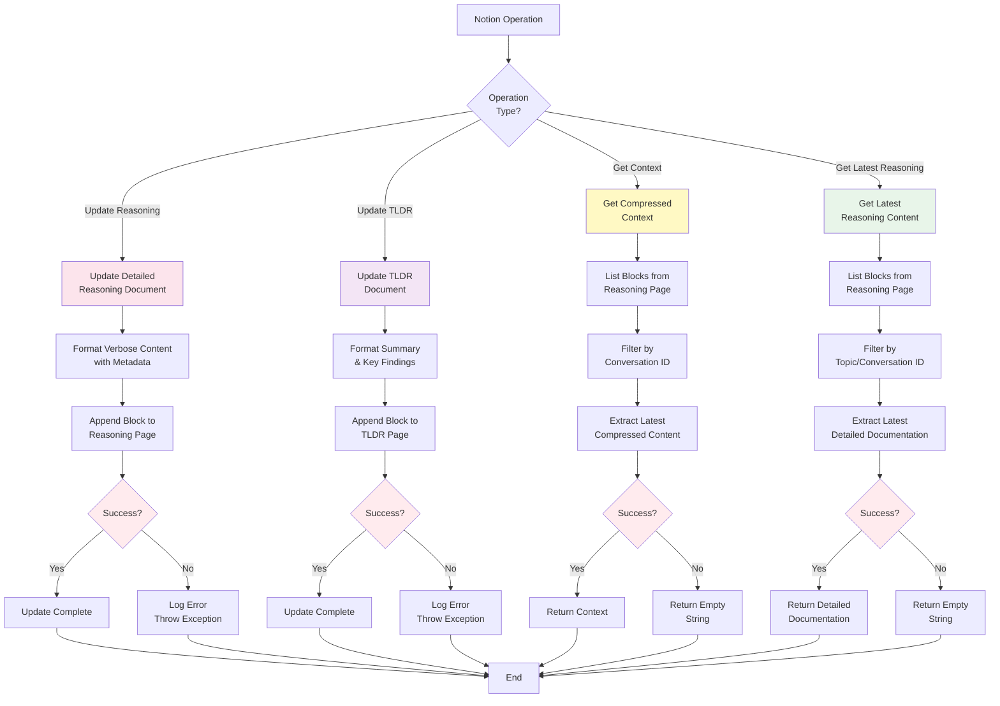

## Command Handling Flow

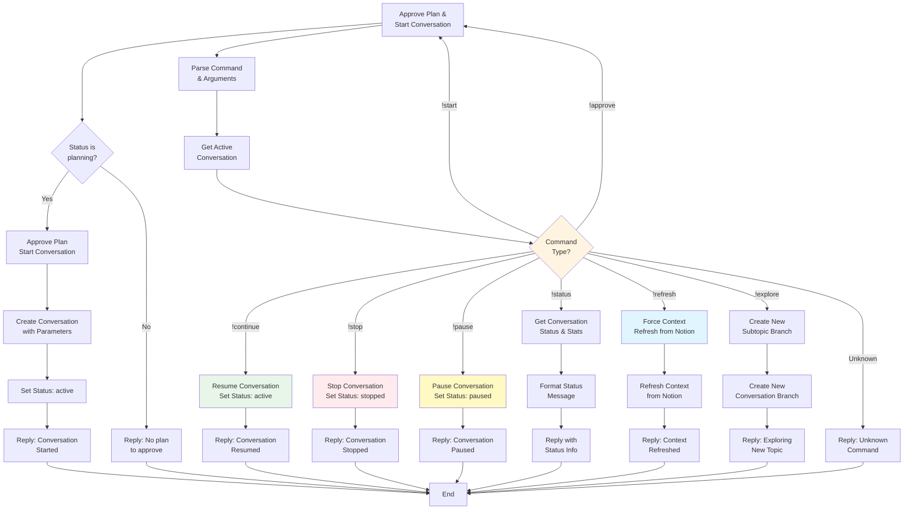

### Discord Failures

* **Message Queue**: Queue messages if Discord unavailable
* **Retry Logic**: Retry failed message sends
* **Admin Notifications**: Notify admins of persistent failures
* **Graceful Degradation**: Continue processing even if Discord temporarily down

## Security Considerations

* Store all API keys in environment variables
* Never log sensitive information
* Validate all user inputs
* Implement rate limiting on bot commands
* Secure Notion API key with proper permissions

## Performance Considerations

* **Async Operations**: Scribe and TLDR run asynchronously, never block conversation flow
* **Batch Updates**: Batch Notion updates when possible (group multiple changes)
* **Caching**: Cache context compressions and Notion content
* **Connection Pooling**: Implement connection pooling for all API clients
* **Token Monitoring**: Track token usage per conversation and provider
* **Queue Management**: Use priority queues for AI responses (user messages > AI responses)
* **Parallel Processing**: Process multiple AI responses in parallel when possible
* **Debouncing**: Debounce Scribe updates to avoid excessive Notion API calls

## Conversation Control Commands

### User Commands

* `!start` or `!approve` - Approve the session plan and start the conversation (planning phase only)
* `!continue` - Resume a paused conversation
* `!stop` - Stop the current conversation (can be used by moderator or user)
* `!pause` - Pause the conversation temporarily
* `!explore <topic>` - Explore a new subtopic
* `!status` - Check conversation status and limits
* `!refresh` - Force context refresh from Notion
* `!focus` - Request moderator to refocus conversation (if off-topic)
* `!summary` - Request conversation summary (moderator may auto-generate at end)

### Admin Commands

* `!config <setting> <value>` - Update configuration
* `!enable <ai>` - Enable specific AI model
* `!disable <ai>` - Disable specific AI model
* `!reset` - Reset conversation limits

## Implementation Guide

For detailed implementation instructions, see [IMPLEMENTATION.md](./IMPLEMENTATION.md).

The implementation guide includes:

* Complete project structure
* 11 phases with 50+ detailed tasks
* Step-by-step instructions for each component
* Acceptance criteria and code examples
* Development best practices
* Dependency graphs and critical path analysis

## Prompt System

All system prompts are stored in `src/prompts/` as separate `.txt` files for easy editing and maintenance:

* **Session Planner Prompts**:
  * `session-planner-analyze.txt` - Message analysis and question generation
  * `session-planner-plan.txt` - Conversation plan creation
  * `session-planner-drift.txt` - Topic drift detection

* **Scribe Bot Prompt**:
  * `scribe-compress.txt` - Verbose documentation instructions

* **TLDR Bot Prompt**:
  * `tldr-summary.txt` - Executive summary extraction from detailed docs

* **Conversation Coordinator Prompt**:
  * `conversation-coordinator.txt` - System prompt for AI participants

**Features**:

* Variable replacement: Use `{variableName}` syntax for dynamic content
* Caching: Prompts are cached in memory for performance
* Easy updates: Edit `.txt` files without code changes
* Documentation: See `src/prompts/README.md` for details

## Two-Tier Documentation System

The system implements a two-tier documentation approach:

1. **Scribe Bot (Verbose Layer)**:
   * Creates detailed, comprehensive documentation
   * Preserves ALL key reasoning, thought processes, and technical details
   * Maintains complete discussion flow with context
   * Stores in Notion reasoning document
   * Goal: Comprehensive record for future reference

2. **TLDR Bot (Summary Layer)**:
   * Extracts concise executive summaries from Scribe's detailed documentation
   * Reads from Notion (not raw conversation)
   * Creates 2-3 paragraph summaries and 3-5 key findings
   * Goal: Quick overview for decision-makers

**Benefits**:

* Detailed information preserved (Scribe)
* Quick summaries available (TLDR)
* TLDR always based on most complete documentation
* No information loss in summarization process
* Efficient: TLDR doesn't need to process raw conversation

## Future Enhancements

* Web dashboard for conversation management
* Multiple channel support
* Custom AI model configurations per channel
* Advanced compression algorithms
* Real-time collaboration features
* Export conversations to various formats
* Conversation templates and presets
* Analytics and insights dashboard
