# Super Brainstorm Bot - Architecture Document

## Overview

The Super Brainstorm Bot is a Discord-based multi-AI collaboration system that enables multiple AI models (including Claude, ChatGPT, Grok, and 300+ others via OpenRouter) to engage in collaborative brainstorming sessions with human participants. The system includes intelligent conversation management, context compression, automatic documentation in Notion, and image generation capabilities.

## Core Components

### 1. Discord Bot Core

* **Purpose**: Main entry point for all interactions
* **Responsibilities**:
  * Listen to messages in designated channels
  * Route messages to appropriate handlers
  * Manage conversation state
  * Coordinate AI responses
  * Handle message threading and replies

### 2. AI Adapter System

* **Purpose**: Unified interface for all AI models via OpenRouter
* **Provider**: OpenRouter API (https://openrouter.ai)
* **Supported Models**: 300+ models from multiple providers including:
  * OpenAI (GPT-4o, GPT-4 Turbo, GPT-3.5, etc.)
  * Anthropic (Claude 3.5 Sonnet, Claude 3 Opus, etc.)
  * Grok (Grok-2, Grok-3, etc.)
  * And 300+ other models from various providers
* **Implementation**: Single `OpenRouterAdapter` using `@openrouter/ai-sdk-provider`
* **Model Format**: `"provider/model-id"` (e.g., `"openai/gpt-4o"`, `"anthropic/claude-3-5-sonnet"`)
* **Responsibilities**:
  * Standardize API calls across all models using OpenRouter's unified API
  * Handle rate limiting with circuit breaker pattern
  * Format responses for Discord
  * Support web search for compatible models
  * Track token usage and costs (direct from API responses)
* **Features**:
  * **Single API Key**: Only one API key needed (OpenRouter) instead of multiple provider keys
  * **Unified Interface**: Same API for all models regardless of provider
  * **On-Demand Adapters**: Creates adapters dynamically for any OpenRouter model ID
  * **Web Search**: Built-in support for models that support web search
  * **Cost Tracking**: Tracks input/output tokens and calculates costs per model
  * **High Availability**: Automatic failover and enterprise-grade infrastructure via OpenRouter
  * **Easy Model Switching**: Change models by simply updating model ID string

### 3. Conversation Coordinator

* **Purpose**: Orchestrate multi-AI conversations
* **Responsibilities**:
  * Track conversation threads
  * Manage turn-taking logic
  * Detect when AIs should respond
  * Implement conversation limits (cost limits, message limits, timeouts)
  * Queue AI responses
  * Handle AI response failures gracefully
  * Manage conversation timeouts

### 4. Context Manager

* **Purpose**: Manage conversation context and memory
* **Responsibilities**:
  * Track conversation history
  * Monitor message count and trigger context refresh from Notion when threshold is reached
  * Compress context when needed
  * Manage conversation state and metadata

### 5. Scribe Bot

* **Purpose**: Create detailed, verbose documentation of conversations in Notion
* **Responsibilities**:
  * Monitor all conversation messages (asynchronously)
  * Create comprehensive, verbose documentation (preserves all important information)
  * Extract and preserve ALL key reasoning and thought processes
  * Maintain complete discussion flow with context
  * Keep technical details, specific findings, and examples
  * Update Notion document with detailed reasoning
  * Maintain conversation history timeline
  * Provide context refresh capability
  * Debounce updates to avoid excessive API calls
  * Handle Notion API failures gracefully
* **Note**: Creates verbose documentation, not compressed summaries. This detailed documentation is used by TLDR bot to extract concise summaries.

### 6. TLDR Bot

* **Purpose**: Extract concise executive summaries from Scribe's detailed documentation
* **Responsibilities**:
  * Monitor conversation progress
  * Read detailed documentation from Notion (Scribe's verbose content)
  * Extract concise executive summaries from the detailed documentation
  * Extract 3-5 key findings from the detailed documentation
  * Update Notion TLDR document
  * Highlight key findings and conclusions
* **Note**: Extracts summaries from Scribe's detailed Notion documentation rather than generating from raw conversation. This creates a two-tier documentation system.

### 7. Image Generation Bot

* **Purpose**: Generate images based on text prompts from TLDR summaries, linked messages, or user-provided prompts
* **Responsibilities**:
  * Generate images using multiple image generation models in parallel
  * Extract prompts from TLDR summaries or linked Discord messages
  * Support image input via attachments (for future vision model integration)
  * Use default image models: DALL-E 3 and Gemini 2.5 Flash
  * Track image generation models as active agents
  * Handle image generation errors gracefully
* **Default Models**:
  * `openai/dall-e-3` - DALL-E 3 for high-quality image generation
  * `google/gemini-2.0-flash-exp:free` - Gemini 2.5 Flash (if supports image generation)
* **Features**:
  * Can be triggered by `/image` slash command
  * Accepts message links to extract prompts from previous messages
  * Accepts direct text prompts
  * Accepts image attachments as reference (future: vision model integration)
  * Generates multiple images in parallel for diverse outputs
  * Protected agent (cannot be stopped via `/stop` command)

### 7. Session Planner Bot (Session Moderator)

* **Purpose**: Plan, moderate, and oversee conversations to ensure productive outcomes from all participants (AI and human)
* **Responsibilities**:
  * **Planning Phase**:
    * Analyze user's initial message/topic
    * Identify areas needing clarification
    * Post clarifying questions in thread replies
    * Assess appropriate conversation length and complexity
    * Set conversation parameters (max messages, max tokens, timeout)
    * Create a detailed conversation plan
    * Expand on the user's original message
    * Wait for user approval before starting conversation
    * Initialize conversation with approved parameters
    * Transition to active conversation state
  * **Moderation Phase** (Ongoing):
    * Monitor all conversation messages (AI and human participants)
    * Detect topic drift and off-topic discussions
    * Steer conversations back on track when needed
    * Track conversation progress against plan
    * Monitor conversation limits and timeouts
    * Stop conversations when appropriate (time limits, goal achieved, off-track)
    * Ensure productive participation from all personas
    * Provide gentle guidance to keep focus on objectives
    * Assess conversation quality and outcomes

### 8. Notion Integration

* **Purpose**: Persistent storage and documentation
* **Responsibilities**:
  * Store conversation history
  * Store detailed reasoning documentation (from Scribe bot)
  * Store TLDR summaries (from TLDR bot)
  * Provide context retrieval API
  * Provide latest reasoning content retrieval (for TLDR bot)

### 9. Web Search Integration

* **Purpose**: Provide real-time web search capabilities to AI agents
* **Implementation**: Built-in web search support via OpenRouter
* **Supported Models**: Models that support web search through OpenRouter
  * See: [OpenRouter Web Search Documentation](https://openrouter.ai/docs/features/web-search)
  * Includes Grok models and other compatible models
* **Features**:
  * Automatic search when supported by the model
  * Citations included in responses
  * Multiple data sources (web, social media, news, RSS)
  * No additional API keys required - handled by OpenRouter
  * Seamless integration with model responses

### 10. Model Configuration System

* **Purpose**: Model configuration and cost tracking
* **Responsibilities**:
  * Maintain model metadata (context windows, pricing, availability)
  * Track costs for different models
  * Provide default model selections
  * Fetch model information from OpenRouter API when needed
* **Features**:
  * **OpenRouter Integration**: Uses OpenRouter's unified model format (`provider/model-id`)
  * **Pricing Information**: Cost data comes directly from OpenRouter API responses (`total_cost` field)
  * **Default Model Selection**: Configurable defaults per task type (general/coding/architecture) in `default-settings.json`
  * **Dynamic Model Selection**: Models selected based on task type with presets stored in `default-settings.json`
  * **Runtime Fetching**: Model information can be fetched directly from OpenRouter API when needed
* **Model Format**: OpenRouter uses `"provider/model-id"` format (e.g., `"openai/gpt-4o"`)
* **Files**:
  * `src/config/default-settings.json`: Default model presets, limits, and intervals
  * `src/config/settings-loader.ts`: Settings loader utility
* **Data Source**: All model information (pricing, availability) comes from OpenRouter's `/api/v1/models` endpoint
* **Reference**: https://openrouter.ai/docs/api-reference/models/get-models
* **Note**: Model information is fetched directly from OpenRouter API at runtime. Default model presets are stored in `default-settings.json` and can be modified via `/sbb settings` command

## System Architecture

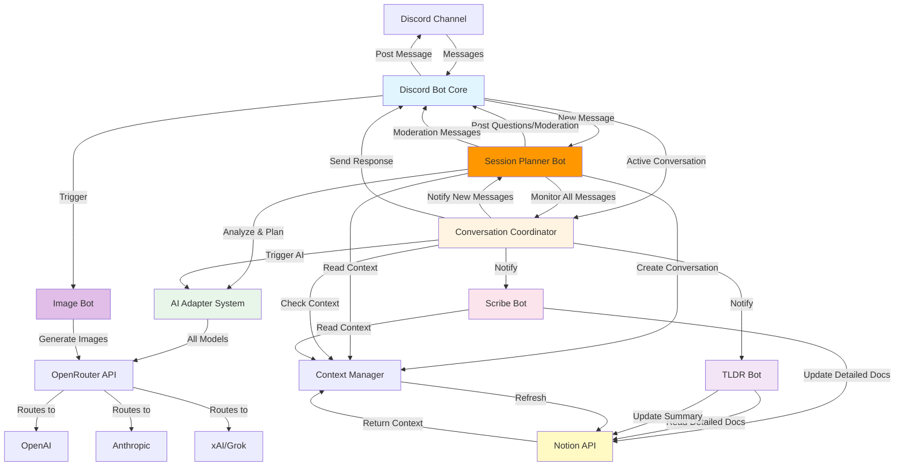

## Conversation Flow

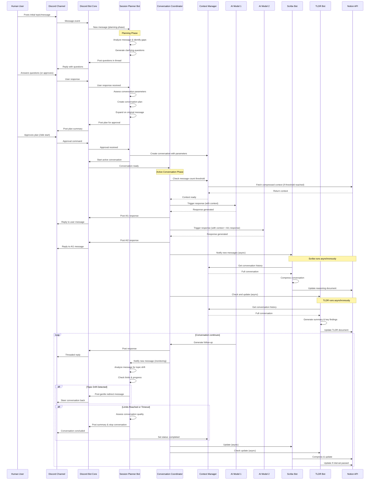

## AI Adapter Architecture

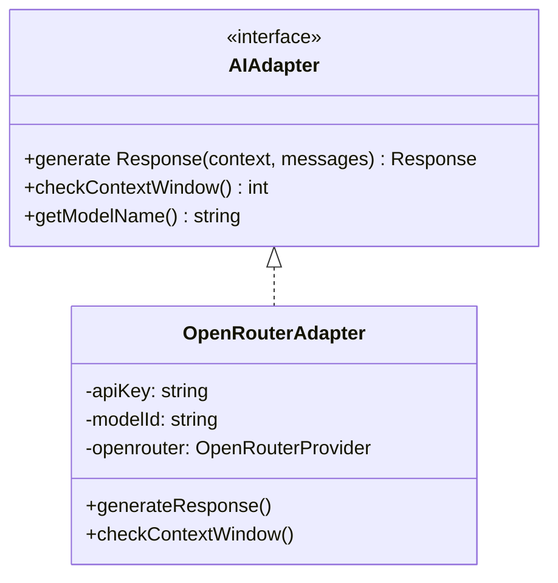

## Context Management Flow

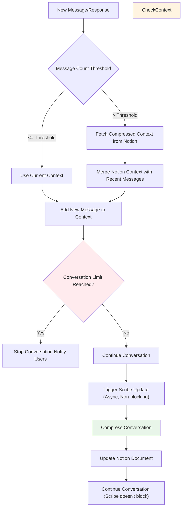

## Scribe Bot Workflow

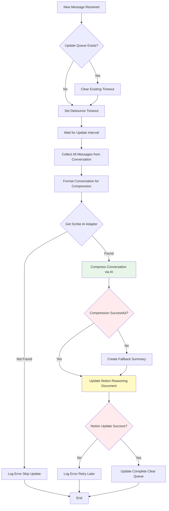

### Scribe Bot Details

* **Verbose Documentation**: Creates detailed, comprehensive documentation rather than compressed summaries
* **Information Preservation**: Preserves ALL key reasoning, thought processes, technical details, and examples
* **Structure**: Maintains complete discussion flow with context in a structured format
* **Debouncing**: Updates are debounced by `SCRIBE_UPDATE_INTERVAL` seconds to avoid excessive API calls
* **Immediate Processing**: `processMessagesImmediate()` method bypasses debouncing for immediate processing (used when starting conversations in threads)
* **Error Handling**: If documentation generation fails, creates a fallback summary with basic conversation stats
* **Non-blocking**: All operations are asynchronous and never block conversation flow
* **Queue Management**: Each conversation has its own update queue with timeout management
* **Prompt**: Uses `src/prompts/scribe-compress.txt` for documentation instructions

## Session Planner Bot Workflow

```mermaid
flowchart TD
    Start[New Initial Message] --> Analyze[Analyze Message via AI]
    Analyze --> IdentifyGaps[Identify Areas Needing Clarification]
    
    IdentifyGaps --> HasGaps{Clarification Needed?}
    HasGaps -->|Yes| GenerateQuestions[Generate Clarifying Questions via AI]
    HasGaps -->|No| AssessParams[Assess Conversation Parameters]
    
    GenerateQuestions --> PostQuestions[Post Questions in Thread Reply]
    PostQuestions --> SetStatusPlanning[Set Conversation Status: planning]
    SetStatusPlanning --> WaitResponse[Wait for User Response in Thread]
    
    WaitResponse --> CheckResponse{User Responded?}
    CheckResponse -->|No| CheckTimeout{Timeout Reached?}
    CheckTimeout -->|Yes| CancelPlanning[Cancel Planning Notify User]
    CheckTimeout -->|No| WaitResponse
    
    CheckResponse -->|Yes| ParseResponse[Parse User Response]
    ParseResponse --> AssessParams
    
    AssessParams --> EstimateComplexity[Estimate Conversation Complexity]
    EstimateComplexity --> CalculateParams[Calculate Parameters: Max Messages, Timeout, Cost Limit]
    
    CalculateParams --> CreatePlan[Create Conversation Plan via AI]
    CreatePlan --> ExpandMessage[Expand on Original Message via AI]
    ExpandMessage --> FormatPlan[Format Plan with Expanded Topic, Parameters, Expected Duration, Key Areas to Explore]
    
    FormatPlan --> PostPlan[Post Plan Summary for Approval]
    PostPlan --> WaitApproval[Wait for Approval Command: /sbb start]
    
    WaitApproval --> CheckApproval{Approval Received?}
    CheckApproval -->|No| CheckTimeout2{Timeout Reached?}
    CheckTimeout2 -->|Yes| CancelPlanning
    CheckTimeout2 -->|No| WaitApproval
    
    CheckApproval -->|Yes| CreateConversation[Create Conversationwith Parameters]
    CreateConversation --> SetStatusActive[Set Status: active]
    SetStatusActive --> InitializeContext[Initialize Contextwith Expanded Message]
    InitializeContext --> NotifyCoordinator[Notify Conversation Coordinator]
    NotifyCoordinator --> Complete[Planning Complete Conversation Ready]
    
    CancelPlanning --> End[End]
    Complete --> End
    
    style Analyze fill:#ff9800
    style GenerateQuestions fill:#fff4e1
    style AssessParams fill:#e1f5ff
    style CreatePlan fill:#e8f5e9
    style PostPlan fill:#fce4ec
    style CheckApproval fill:#fff9c4
    style CreateConversation fill:#f3e5f5
```

### Session Planner Bot Details

* **Analysis Phase**: Uses AI to analyze the initial message and identify gaps or ambiguities
* **Clarification Questions**: Posts questions as thread replies to the original message
* **Parameter Assessment**: Estimates conversation complexity based on:
  * Topic breadth and depth
  * Expected number of subtopics
  * Required detail level
  * Historical similar conversations
* **Dynamic Parameters**: Sets conversation limits based on assessment:
  * `maxMessagesPerConversation`: Based on expected scope (default: 100-1000)
  * `maxTokensPerConversation`: Based on complexity (default: 100k-5M)
  * `conversationTimeoutMinutes`: Based on expected duration (default: 30-120)
  * `maxContextWindowPercent`: Based on expected context needs (default: 70-80)
* **Plan Creation**: Generates a structured plan including:
  * Expanded and clarified topic description
  * Key areas to explore
  * Expected conversation flow
  * Estimated duration and resource usage
* **Approval Mechanism**: Waits for explicit user approval via `/sbb start` slash command
* **Timeout Handling**: Cancels planning if no response within timeout period (default: 30 minutes)

## Session Moderator Workflow (Ongoing Moderation)

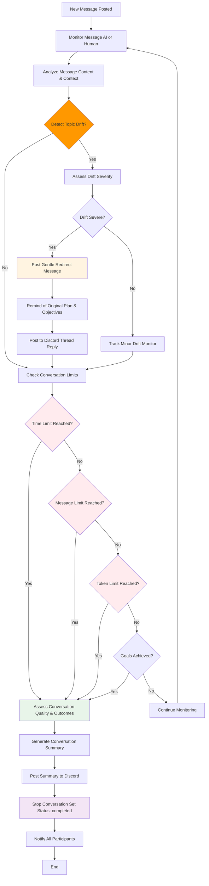

### Session Moderator Details

* **Continuous Monitoring**: Monitors all messages from both AI and human participants in real-time
* **Topic Drift Detection**: Uses AI to analyze message content against original plan and objectives
  * Semantic similarity analysis
  * Keyword/topic tracking
  * Context relevance scoring
* **Gentle Steering**: When off-topic, posts polite redirects that:
  * Acknowledge the current discussion
  * Remind of original objectives
  * Suggest returning to main topic
  * Reference the conversation plan
* **Limit Management**: Actively monitors and enforces:
  * Time limits (conversation timeout)
  * Message count limits
  * Cost limits (conversation and image generation)
  * Timeout limits
* **Quality Assessment**: Before stopping, evaluates:
  * Goals achieved vs. original plan
  * Key insights generated
  * Participant engagement quality
  * Conversation productivity
* **Graceful Termination**: When stopping:
  * Generates conversation summary
  * Highlights key outcomes
  * Thanks all participants
  * Provides closure
* **Participant Oversight**: Ensures:
  * All personas (AI and human) contribute meaningfully
  * No single participant dominates
  * Balanced discussion flow
  * Productive collaboration

## TLDR Bot Workflow

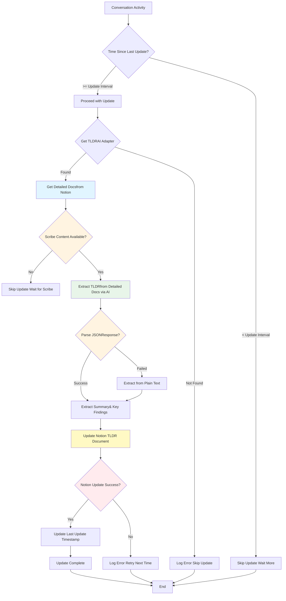

### TLDR Bot Details

* **Source**: Reads detailed documentation from Notion (Scribe's verbose content) rather than raw conversation
* **Two-Tier System**: Extracts concise summaries from the detailed documentation, ensuring no information loss
* **Time-based Throttling**: Updates are throttled by `TLDR_UPDATE_INTERVAL` seconds to avoid excessive API calls
* **Immediate Processing**: `updateImmediate()` method bypasses throttling for immediate processing (used when starting conversations in threads)
* **Update Interval**: Only updates every `TLDR_UPDATE_INTERVAL` seconds (default: 600s / 10 minutes)
* **JSON Parsing**: Attempts to parse structured JSON response, falls back to text extraction
* **Key Findings**: Extracts 3-5 key findings or conclusions from the detailed documentation
* **Non-blocking**: All operations are asynchronous and never block conversation flow
* **Timestamp Tracking**: Tracks last update time per conversation to prevent excessive updates
* **Graceful Handling**: Skips update if Scribe content not yet available
* **Prompt**: Uses `src/prompts/tldr-summary.txt` for extraction instructions

## Message Threading Strategy

### Discord Threading Model

* **Reply-to-Message**: Use Discord's message reply feature (references parent message)
* **Message References**: Track which messages each AI is responding to
* **Batch Replies**: When AI responds after multiple messages, reference all relevant messages
* **Thread Channels**: Optionally create Discord thread channels for extended conversations

### Reply Logic

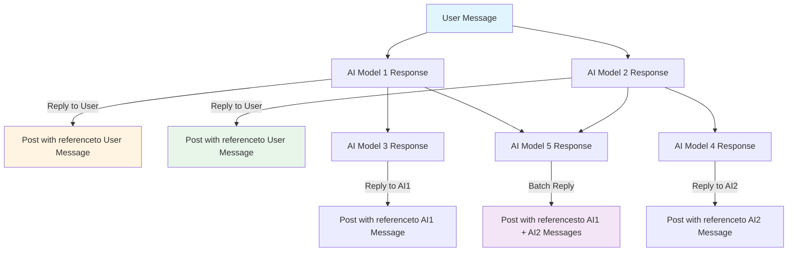

### Batching Logic

* **Time Window**: If multiple messages arrive within 5-10 seconds, AI can batch respond
* **Context Relevance**: AI decides which messages to reference based on relevance
* **Max References**: Limit to 3-5 message references per response (Discord limitation)
* **Smart Batching**: AI analyzes if responses should be combined or separate

## Message Processing Flow

```mermaid
flowchart TD
    DiscordMsg[Discord Message] --> CheckConversation{Conversation Exists?}
    
    CheckConversation -->|No| PlanningPhase[Session Planner Phase]
    CheckConversation -->|Yes| GetConversation[Get Conversation]
    
    PlanningPhase --> AnalyzeMessage[Analyze Initial Message]
    AnalyzeMessage --> IdentifyGaps[Identify Areas Needing Clarification]
    IdentifyGaps --> GenerateQuestions[Generate Clarifying Questions via AI]
    GenerateQuestions --> PostQuestions[Post Questionsin Thread]
    PostQuestions --> WaitResponse[Wait for User Response]
    
    WaitResponse --> CheckApproval{User Approvedor Answered?}
    CheckApproval -->|No| WaitResponse
    CheckApproval -->|Yes| AssessParams[Assess Conversation Parameters]
    
    AssessParams --> CreatePlan[Create Conversation Plan & Expand Message]
    CreatePlan --> PostPlan[Post Plan for Approval]
    PostPlan --> WaitApproval[Wait for Approval Command]
    
    WaitApproval --> CheckApprovalCmd{Approval Received?}
    CheckApprovalCmd -->|No| WaitApproval
    CheckApprovalCmd -->|Yes| CreateConv[Create Conversationwith Parameters]
    CreateConv --> SetActive[Set Status: active]
    SetActive --> GetConversation
    
    GetConversation --> ConvertMsg[Convert to App Message Format]
    ConvertMsg --> CheckStatus{Conversation Status?}
    
    CheckStatus -->|active| CheckLimits[Check Conversation Limits]
    CheckStatus -->|paused/stopped| Ignore[Ignore Message]
    CheckStatus -->|planning| PlanningPhase
    
    CheckLimits --> LimitsOK{Limits OK?}
    LimitsOK -->|No| StopConv[Stop Conversation Notify User]
    LimitsOK -->|Yes| CheckMessageCount{Message Count Threshold?}
    
    CheckMessageCount -->|> Threshold| RefreshContext[Refresh Context from Notion]
    CheckContext -->|OK| AddMessage[Add Messageto Context]
    
    RefreshContext --> AddMessage
    AddMessage --> ShouldRespond{Should AIs Respond?}
    
    ShouldRespond -->|Yes| TriggerAI[Trigger AIResponses]
    ShouldRespond -->|No| NotifyScribe[Notify Scribe Bot Async]
    
    TriggerAI --> QueueResponses[Queue AI Responses Parallel Processing]
    QueueResponses --> GenerateResponses[Generate Responsesvia Adapters]
    GenerateResponses --> PostResponses[Post to Discordvia Callback]
    
    PostResponses --> NotifyModerator[Notify Session Moderator Monitor Message]
    NotifyModerator --> CheckTopicDrift{Moderator:Topic Drift?}
    
    CheckTopicDrift -->|Yes| PostRedirect[Moderator: Post Redirect Message]
    PostRedirect --> NotifyScribe
    CheckTopicDrift -->|No| CheckModeratorLimits{Moderator:Limits Reached?}
    
    CheckModeratorLimits -->|Yes| StopByModerator[Moderator: Stop Conversation]
    CheckModeratorLimits -->|No| NotifyScribe
    
    NotifyScribe --> NotifyTLDR[Notify TLDR Bot Async Check]
    NotifyTLDR --> End
    
    StopByModerator --> End
    
    StopConv --> End
    Ignore --> End
    
    style PlanningPhase fill:#ff9800
    style CheckLimits fill:#ffebee
    style CheckContext fill:#fff4e1
    style TriggerAI fill:#e8f5e9
    style NotifyScribe fill:#fce4ec
    style NotifyTLDR fill:#f3e5f5
    style CheckApproval fill:#fff9c4
    style AssessParams fill:#e1f5ff
    style CheckTopicDrift fill:#ff9800
    style CheckModeratorLimits fill:#ff9800
    style PostRedirect fill:#fff4e1
```

## AI Response Generation Flow

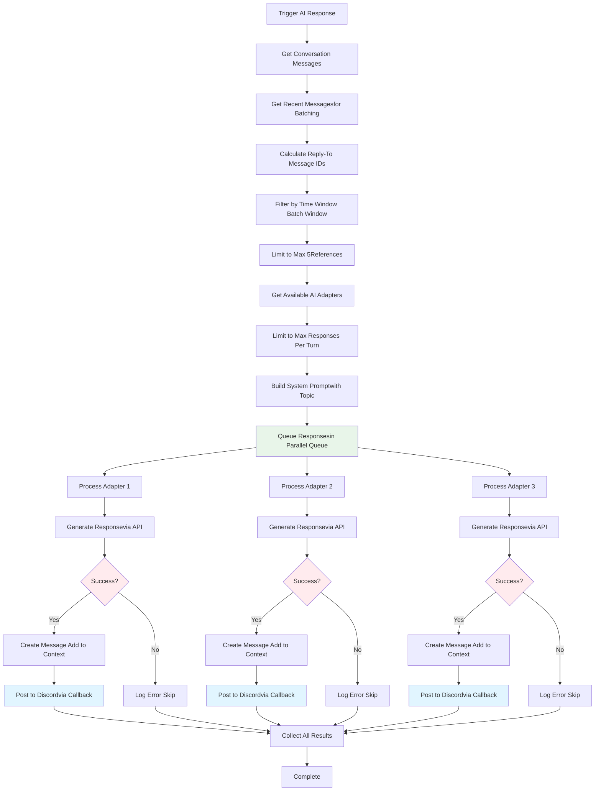

## Data Models

### Conversation State

```typescript
interface ConversationState {
  id: string;
  channel Id: string;
  topic: string;
  participants: string[]; // AI model names + user IDs
  messages: Message[];
  contextWindow: {
    current: number;
    max: number;
    provider: string;
  };
  status: 'planning' | 'active' | 'paused' | 'completed' | 'stopped';
  planningState?: {
    questions: string[];
    plan?: string;
    expandedTopic?: string;
    parameters?: {
      max Messages: number;
      maxTokens: number;
      timeoutMinutes: number;
      maxContextWindowPercent: number;
    };
    awaitingApproval: boolean;
  };
  moderationState?: {
    topic DriftCount: number;
    lastTopicCheck: Date;
    originalObjectives: string[];
    currentFocus: string;
    participantBalance: Map<string, number>; // participantId -> message count
    qualityScore?: number;
  };
  createdAt: Date;
  lastActivity: Date;
  messageCount: number;
  tokenCount: number;
}
```

### Message

```typescript
interface Message {
  id: string;
  conversation Id: string;
  authorId: string;
  authorType: 'user' | 'ai';
  content: string;
  replyTo: string[]; // Array of message IDs
  timestamp: Date;
  model?: string; // If AI message
  tokens?: number;
}
```

### AI Response

```typescript
interface AIResponse {
  content: string;
  model: string;
  tokens: number;
  reply To: string[];
  contextUsed: number;
}
```

## Configuration

### Environment Variables

```bash
# Discord
DISCORD_BOT_TOKEN=
DISCORD_GUILD_ID=
DISCORD_CHANNEL_ID=

# OpenRouter (provides access to all AI models)
OPENROUTER_API_KEY=your_openrouter_api_key_here
# Get your API key from: https://openrouter.ai/keys

# Notion (required)
# Single database/page ID that hosts all topics as entries
# Each entry contains: Topic name, TLDR content
# Each entry has a subpage: "Reasoning & Transcript" with detailed reasoning
NOTION_API_KEY=
NOTION_PAGE_ID=

# Logging (optional)
LOG_LEVEL=info
```

## API Integrations

### Discord API

* **Library**: discord.js
* **Features**:
  * Message listening
  * Message threading/replies
  * Rich embeds
  * Rate limiting handling

### OpenRouter API

* **Endpoint**: `https://openrouter.ai/api/v1/chat/completions`
* **Authentication**: Bearer token (OpenRouter API key)
* **Model Format**: `"provider/model-id"` (e.g., `"openai/gpt-4o"`, `"anthropic/claude-3-5-sonnet"`)
* **Supported Models**: 300+ models from multiple providers
* **Documentation**: https://openrouter.ai/docs/api-reference/overview
* **Benefits**:
  * Single API key for all models
  * Unified interface across providers
  * Automatic failover and high availability
  * Built-in web search support for compatible models
  * Transparent pricing and cost tracking
* **Example Models**:
  * OpenAI: `openai/gpt-4o`, `openai/gpt-4-turbo`, `openai/gpt-3.5-turbo`
  * Anthropic: `anthropic/claude-3-5-sonnet`, `anthropic/claude-3-opus`
  * Grok: `x-ai/grok-2`, `x-ai/grok-beta`
  * See full list: https://openrouter.ai/models

### Notion API

* **Endpoint**: `https://api.notion.com/v1`
* **Features**:
  * Page updates
  * Block manipulation
  * Database queries
  * Rich text formatting

## Implementation Steps

### Phase 1: Foundation

1. Set up project structure
2. Initialize Node.js/TypeScript project
3. Set up environment configuration
4. Install core dependencies

### Phase 2: Discord Integration

1. Create Discord bot application
2. Implement message listening
3. Implement message posting with threading
4. Add rate limiting handling

### Phase 3: AI Adapter System

1. Create AI adapter interface
2. Implement OpenRouter adapter (unified adapter for all models)
3. Add adapter factory/registry with on-demand adapter creation
4. Configure default models for each provider type

### Phase 4: Session Planner Bot (Session Moderator)

1. **Planning Phase**:
   * Implement message analysis logic
   * Create clarification question generation
   * Implement parameter assessment algorithm
   * Create conversation plan generation
   * Implement message expansion logic
   * Add approval mechanism and timeout handling
   * Integrate with conversation creation
2. **Moderation Phase**:
   * Implement continuous message monitoring
   * Create topic drift detection algorithm
   * Implement semantic similarity analysis
   * Create gentle redirect message generation
   * Implement limit monitoring and enforcement
   * Create conversation quality assessment
   * Implement graceful conversation termination
   * Add participant balance tracking
   * Create conversation summary generation

### Phase 5: Conversation Management

1. Implement conversation state tracking
2. Create conversation coordinator
3. Implement turn-taking logic
4. Add conversation limits and controls
5. Integrate with Session Planner for initialization

### Phase 6: Context Management

1. Implement message count tracking
2. Create context compression logic
3. Implement Notion context retrieval
4. Add context refresh triggers (based on message count threshold)

### Phase 7: Scribe Bot

1. Implement conversation monitoring
2. Create compression/summarization logic
3. Implement Notion document updates
4. Add history maintenance

### Phase 8: TLDR Bot

1. Implement summary generation
2. Create TLDR update logic
3. Implement Notion TLDR document updates
4. Add key findings extraction

### Phase 9: Notion Integration

1. Set up Notion API client
2. Create page structure templates
3. Implement document update logic
4. Add formatting and structure

### Phase 10: Testing & Refinement

1. Test individual components
2. Test end-to-end flows
3. Test context management
4. Test conversation limits
5. Optimize performance

### Phase 11: Documentation & Deployment

1. Create user documentation
2. Create setup guide
3. Add error handling and logging
4. Prepare deployment configuration

## Error Handling

### API Failures

* **Retry Strategy**: Exponential backoff (1s, 2s, 4s, 8s, max 30s)
* **Max Retries**: 3 attempts per request
* **Fallback**: If one AI fails, others continue; log error and notify
* **Circuit Breaker**: Temporarily disable failing adapters after repeated failures

### AI Response Error Handling Flow

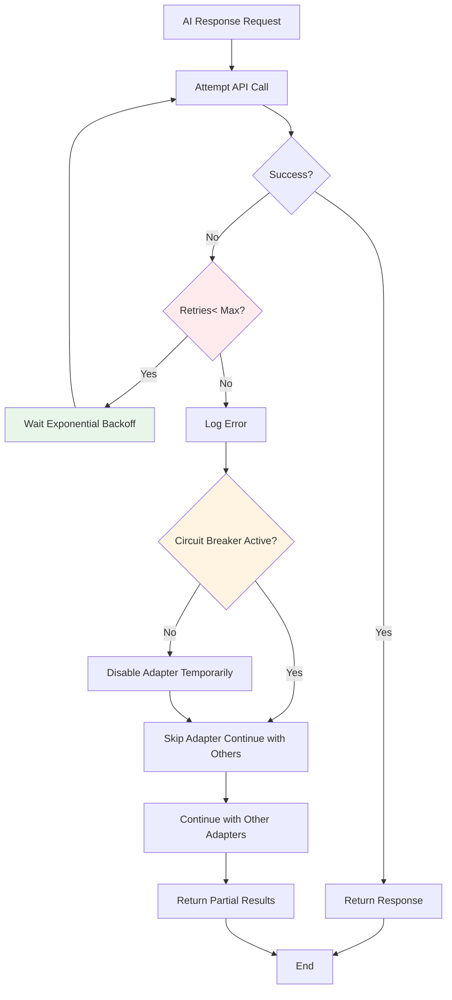

### Notion Error Handling Flow

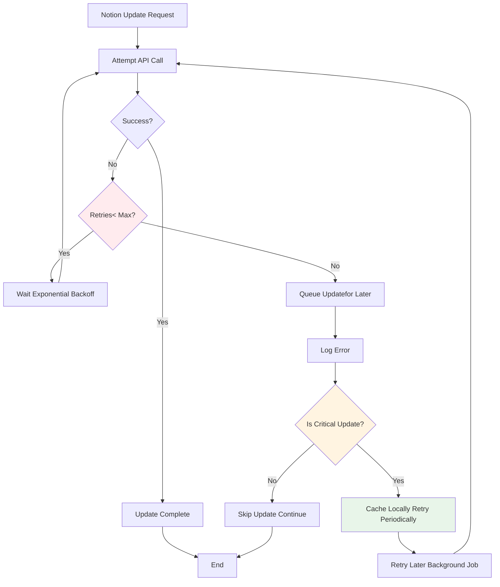

### Discord Error Handling Flow

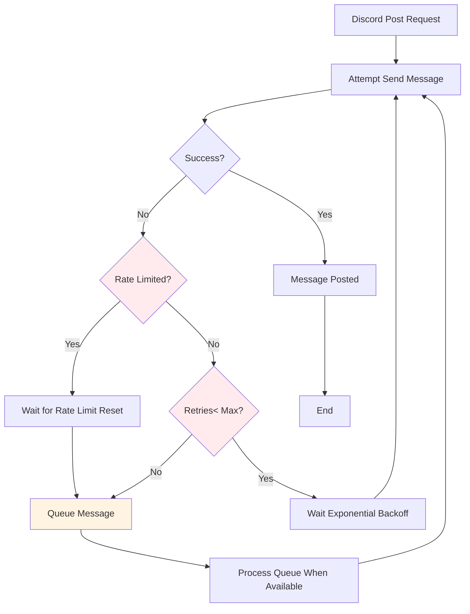

### Rate Limiting

* **Queue Management**: FIFO queue for AI requests per provider
* **Rate Limit Tracking**: Track requests per minute/hour per API
* **Backpressure**: Pause requests when rate limits approached
* **Discord Rate Limits**: Respect 50 requests/second limit, batch when possible

### Context Overflow

* **Automatic Compression**: Trigger when context > 80% full
* **Notion Refresh**: Fetch compressed context when > 50% full
* **Emergency Compression**: Force compression if context exceeds limits
* **Token Counting**: Accurate token counting per provider (use tiktoken, etc.)

### Notion Failures

* **Update Queue**: Queue failed updates and retry
* **Local Cache**: Cache updates locally until Notion succeeds
* **Batch Updates**: Group multiple updates to reduce API calls
* **Fallback Storage**: Log to file if Notion unavailable

## Notion Integration Flow

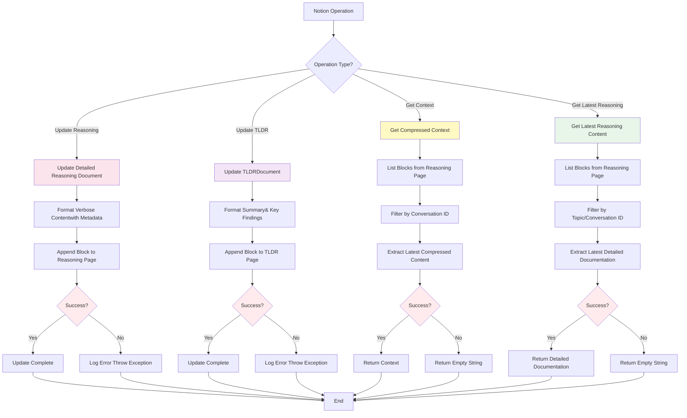

## Command Handling Flow

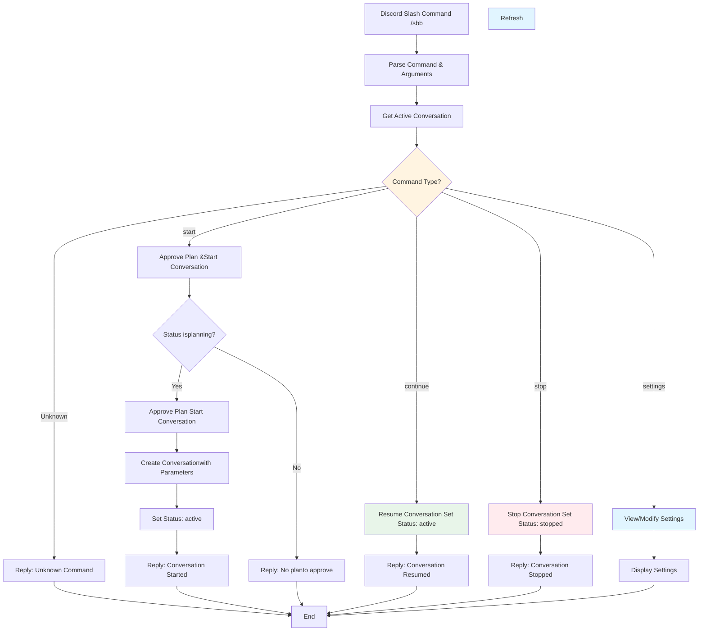

### Discord Failures

* **Message Queue**: Queue messages if Discord unavailable
* **Retry Logic**: Retry failed message sends
* **Admin Notifications**: Notify admins of persistent failures
* **Graceful Degradation**: Continue processing even if Discord temporarily down

## Security Considerations

* Store all API keys in environment variables
* Never log sensitive information
* Validate all user inputs
* Implement rate limiting on bot commands
* Secure Notion API key with proper permissions

## Performance Considerations

* **Async Operations**: Scribe, TLDR, and Image Bot run asynchronously, never block conversation flow
* **Batch Updates**: Batch Notion updates when possible (group multiple changes)
* **Caching**: Cache context compressions and Notion content
* **Connection Pooling**: Implement connection pooling for all API clients
* **Token Monitoring**: Track token usage per conversation and provider
* **Queue Management**: Use priority queues for AI responses (user messages > AI responses)
* **Parallel Processing**: Process multiple AI responses and images in parallel when possible
* **Debouncing**: Debounce Scribe updates to avoid excessive Notion API calls

## Thread Support

* **Thread Conversations**: Conversations can run in any Discord thread within the configured server
* **Automatic Thread Detection**: Bot automatically detects when messages are in threads
* **Thread Compilation**: When starting a conversation in a thread with `/sbb start`, the bot:
  * Fetches all previous messages from the thread
  * Adds them to the conversation context
  * Processes them immediately with Scribe (detailed documentation) and TLDR (summary)
  * Waits for both Scribe and TLDR to complete processing
  * Starts planning with the compiled context (Scribe's detailed documentation and TLDR summary)
  * Session Planner analyzes the compiled discussion and creates a plan
  * Uses immediate processing methods (`processMessagesImmediate` and `updateImmediate`) that bypass debouncing/throttling
* **Thread Tracking**: Thread information is stored in conversation state (`threadId`, `isThread`)
* **New Topics**: For new topics, manager starts a fresh thread automatically

## Cost Management

* **Cost Limits**: Each conversation has a configurable cost limit (default: $22 USD for conversations, $2 USD for image generation)
* **Automatic Pausing**: Conversations automatically pause when cost limit is reached
* **Cost Tracking**:
  * Tracks total cost per conversation
  * Tracks cost per model
  * Tracks input/output tokens per model
  * Displays cost information in responses and status commands
* **Cost Calculation**: Uses OpenRouter model pricing (fetched dynamically or fallback pricing)
* **Resume Protection**: `/continue` command checks cost limit before resuming paused conversations

## Agent Management

* **Active Agent Tracking**: System tracks which agents were actually launched during conversation
  * Stored in `conversation.activeAgents` array
  * Updated when agents generate responses
  * Used to determine which agents can be stopped
* **Agent Stopping**:
  * `/stop agent:<model-id>` - Stop a specific agent that was launched
  * `/stop agent:all` - Stop all non-protected agents
  * Only agents in `activeAgents` can be stopped (prevents stopping agents that were never started)
* **Protected Agents**: Manager, Scribe, TLDR, and Image Bot cannot be stopped (required for system operation)
* **Disabled Agents**: Tracked in `conversation.disabledAgents` array
  * Filtered out during response generation
  * Can be re-enabled by removing from disabled list (future feature)

## Conversation Control Commands

All commands use the `/sbb` prefix. The bot also processes regular messages in configured channels and threads to continue conversations.

#### Conversation Management

* `/sbb start [topic]` - Start a new conversation
  * **In a channel**: Starts a new conversation immediately
  * **In a thread**: Compiles previous discussion first, then starts planning
    * Fetches all previous messages from the thread
    * Processes them immediately with Scribe (detailed documentation) and TLDR (summary)
    * Waits for compilation to complete (uses immediate processing methods)
    * Starts planning with the compiled context
  * Automatically detects if you're in a channel or thread
  * Automatically detects task type and selects appropriate models
  * Sets $22 cost limit for conversations and $2 for images by default (configurable in `default-settings.json`)
* `/sbb continue` - Continue a paused conversation
  * Checks cost limit before resuming
  * Shows current cost vs limit

#### Model Management

* `/sbb select-models [task-type] [models] [scribe-model] [tldr-model]` - Select AI models for the conversation
  * `task-type`: Optional. Choose from "general", "coding", or "architecture" to auto-select models
  * `models`: Optional. Comma-separated list of model IDs (e.g., "openai/gpt-5,anthropic/claude-opus-4.1")
  * `scribe-model`: Optional. Override Scribe bot model
  * `tldr-model`: Optional. Override TLDR bot model
* `/sbb add-model <model-id>` - Add a model to the current conversation
* `/sbb remove-model <model-id>` - Remove a model from the current conversation
* `/sbb list-models` - List all models in the current conversation
* `/sbb fetch-models [provider]` - Fetch available models from OpenRouter API (optionally filtered by provider)

#### Agent Control

* `/sbb stop <agent>` - Stop a specific agent or all agents
  * `agent`: Model ID of the agent to stop, or "all" to stop all agents
  * Cannot stop manager, scribe, tldr, or image agents (protected)
  * Only stops agents that were actually launched (tracked in `activeAgents`)

#### Image Generation

* `/sbb image [message-link] [prompt] [attachment]` - Generate images from a message link, prompt, or attachment
  * `message-link`: Optional. Link to a Discord message to use as prompt (extracts content automatically)
  * `prompt`: Optional. Direct text prompt for image generation
  * `attachment`: Optional. Image attachment to use as reference
  * Default models: GPT-5 Image and Gemini 2.5 Flash Image (configurable in `default-settings.json`)
  * Generates multiple images in parallel
  * Separate cost tracking for image generation
  * Image generation is automatically blocked when cost limit ($2 default) is reached
* `/sbb unblock-image` - Unblock image generation if it was blocked due to cost limit
  * Shows current cost vs limit
  * Allows resuming image generation after being blocked

#### Settings

* `/sbb settings` - View and modify bot settings (default models, limits, intervals)
  * Settings are stored in `src/config/default-settings.json`
  * Can be modified interactively via Discord command (future enhancement)

## Implementation Guide

For detailed implementation instructions, see [IMPLEMENTATION.md](./IMPLEMENTATION.md).

The implementation guide includes:

* Complete project structure
* 11 phases with 50+ detailed tasks
* Step-by-step instructions for each component
* Acceptance criteria and code examples
* Development best practices
* Dependency graphs and critical path analysis

## Prompt System

All system prompts are stored in `src/prompts/` as separate `.txt` files for easy editing and maintenance:

* **Session Planner Prompts**:
  * `session-planner-analyze.txt` - Message analysis and question generation
  * `session-planner-plan.txt` - Conversation plan creation
  * `session-planner-drift.txt` - Topic drift detection

* **Scribe Bot Prompt**:
  * `scribe-compress.txt` - Verbose documentation instructions

* **TLDR Bot Prompt**:
  * `tldr-summary.txt` - Executive summary extraction from detailed docs

* **Conversation Coordinator Prompt**:
  * `conversation-coordinator.txt` - System prompt for AI participants

**Features**:

* Variable replacement: Use `{variable Name}` syntax for dynamic content
* Caching: Prompts are cached in memory for performance
* Easy updates: Edit `.txt` files without code changes
* Documentation: See `src/prompts/README.md` for details

## Two-Tier Documentation System

The system implements a two-tier documentation approach:

1. **Scribe Bot (Verbose Layer)**:
   * Creates detailed, comprehensive documentation
   * Preserves ALL key reasoning, thought processes, and technical details
   * Maintains complete discussion flow with context
   * Stores in Notion reasoning document
   * Goal: Comprehensive record for future reference

2. **TLDR Bot (Summary Layer)**:
   * Extracts concise executive summaries from Scribe's detailed documentation
   * Reads from Notion (not raw conversation)
   * Creates 2-3 paragraph summaries and 3-5 key findings
   * Goal: Quick overview for decision-makers

**Benefits**:

* Detailed information preserved (Scribe)
* Quick summaries available (TLDR)
* TLDR always based on most complete documentation
* No information loss in summarization process
* Efficient: TLDR doesn't need to process raw conversation

## Future Enhancements

* Web dashboard for conversation management
* Multiple channel support
* Custom AI model configurations per channel
* Advanced compression algorithms
* Real-time collaboration features
* Export conversations to various formats
* Conversation templates and presets
* Analytics and insights dashboard
